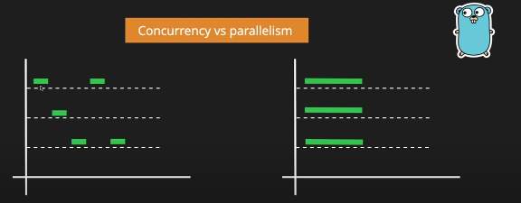

# Concurrency and Parallelism in Go

### Concurrency vs Parallelism

- **Concurrency**: Allowing yourself to handle multiple tasks, but **not at the exact same time**.  
- **Parallelism**: Executing multiple tasks **at the same time**, not one after another.  

**Example (Instagram analogy):**  
Suppose you are eating rice and watching Instagram reels. Suddenly, you get a notification, and you also want to turn on the A.C.

- **Concurrency**:  
  You first check the notification, then turn on the A.C., and finally continue eating rice. Tasks are interleaved, but not simultaneous.  

- **Parallelism**:  
  You **simultaneously** eat rice, check the notification, and turn on the A.C. at the same time.  



---

### Goroutines

- **Goroutines**: Lightweight threads managed by the Go runtime.  
  - Flexible stack (starts at ~2KB).  
- **Threads**: Managed by the operating system.  
  - Fixed stack (usually ~1MB).  

✅ **In Go, goroutines are the way we achieve concurrency (and parallelism when multiple CPU cores are available).**  

The Go runtime can create many goroutines without asking the OS for new threads, giving Go more control and efficiency.

---

### Go’s Motto

> **"Do not communicate by sharing memory; instead, share memory by communicating."**

This philosophy is at the core of Go’s concurrency model.

---

### WaitGroups

When using goroutines, you often need to **wait for all of them to finish**. For this, Go provides **WaitGroups**.

A WaitGroup is like an advanced version of `time.Sleep()`, but more precise and safe.  

**Functions of WaitGroup:**
1. **Add(int)** → Increments the counter by the given number of goroutines.  
2. **Done()** → Decrements the counter by one when a goroutine finishes.  
3. **Wait()** → Blocks until the counter becomes zero (all goroutines finished).  

---

### Mutex (Mutual Exclusion)

- A **mutex** is a lock that ensures only **one goroutine** can access a shared resource at a time.  
- The zero value of a mutex is an unlocked mutex.  
- A mutex must not be copied after first use.  

**Lock/Unlock behavior:**  
- When one goroutine locks the mutex, no other goroutine can access that memory until it is unlocked.  

**Read-Write Mutex:**  
- Multiple goroutines can **read** a resource simultaneously.  
- But **only one goroutine can write**, and during writing, no one else can read or write.

---

### Race Conditions

A **race condition** happens when multiple goroutines access the same memory at the same time, and at least one of them writes to it.

👉 Use:  
```bash
go run --race .
````

This checks for race condition errors in a Go program (exit status 66 if found).
Race conditions can be solved using **mutexes**.

---

### Channels

* **Channels** allow goroutines to communicate with each other by passing values.
* A send operation (`ch <- value`) will block until another goroutine is ready to receive from the channel.
* Similarly, a receive operation (`<-ch`) will block until there is data to receive.
* This ensures synchronization but can lead to **deadlocks** if nobody is listening.

⚠️ Always design your channel communication carefully, often together with WaitGroups.

---

